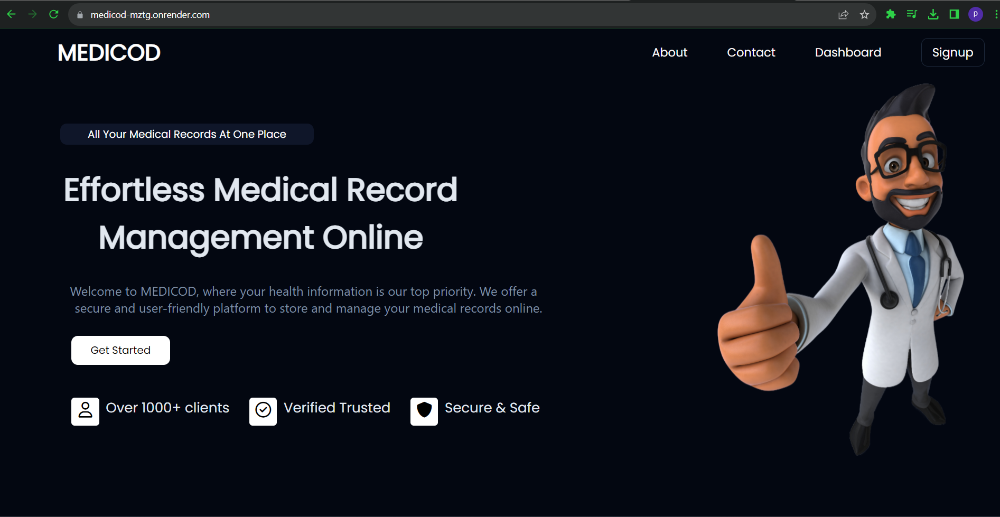
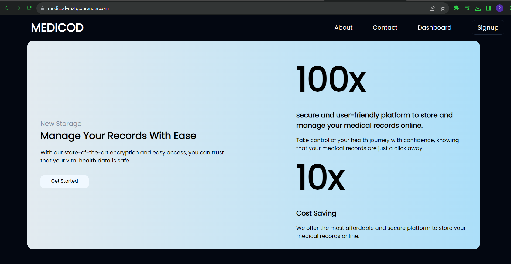
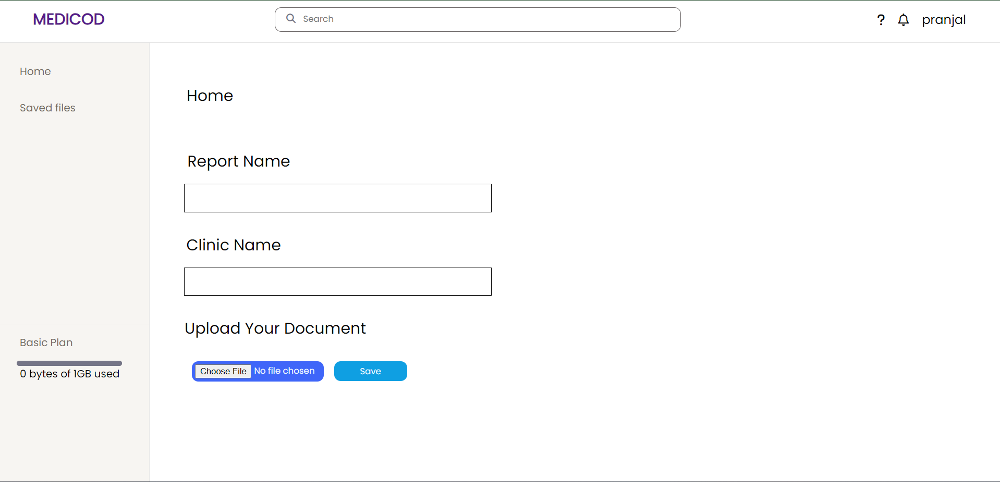

#[ Medicod ](https://medicod-mztg.onrender.com/)

Welcome to Medicod, the app that empowers you to store and manage all your medical records. This documentation will guide you through the features and usage of the Medicod app.

## Table of Contents
1. Getting Started
    - Sign Up and Login
2. Storing Your Medical Records
    - Adding a New Medical Record
    - Viewing Your Medical Records
3. Support and Contact Information

## 1. Getting Started

-
### Sign Up and Login

- To get started with Medicod, visit our website [Medicod](https://medicod-mztg.onrender.com/) and create an account.
- Once you've registered, log in to your account using your credentials.

-

## 2. Storing Your Medical Records

### Adding a New Medical Record

- After logging in, navigate to the "Dashboard" section.
- Fill in the details of your medical record in Markdown format. You can include information such as:
  - Medical condition or diagnosis
  - Attachments (e.g., X-rays, lab reports)
- Save the record when you've added all the necessary information.
- 

### Viewing Your Medical Records

- In the "Saved Records" section, you can see a list of all the medical records you've added.
- Click on a record to view the details . You can also download or print the record for your reference.
- -
  

### Deleting Medical Records

- If you wish to delete a medical record:
  - Access the "Saved Records" section.
  - Click on the record you want to delete.
  - Look for the delete option and confirm the action.

## 6. Support and Contact Information

- For any technical support, inquiries, or feedback, please reach out to our support team at [support@medicod.com].
- We value your feedback and are here to assist you in managing your medical records effectively.

Thank you for choosing Medicod to store and manage your medical records. We are dedicated to providing a secure and user-friendly platform to help you take control of your healthcare information.

Stay healthy and organized with Medicod!

